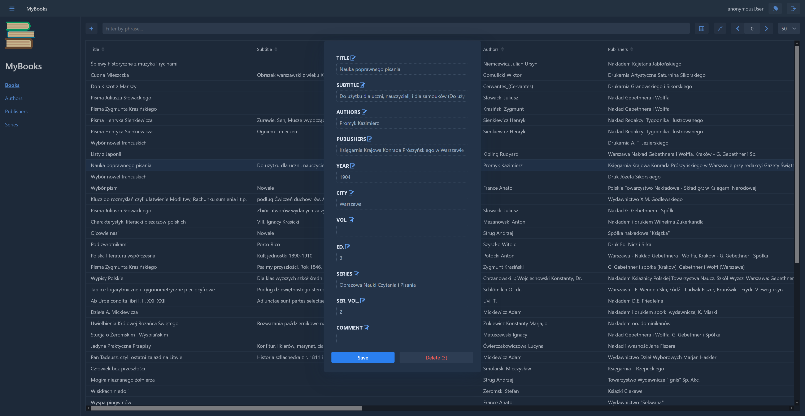
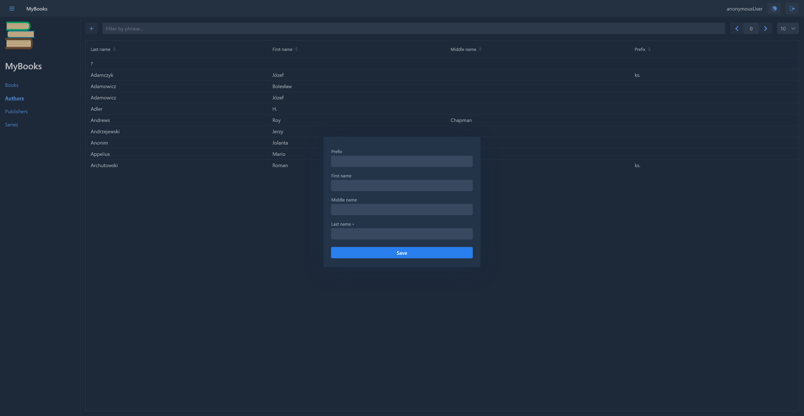
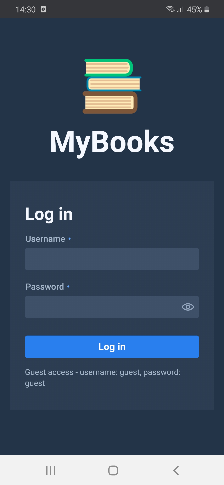
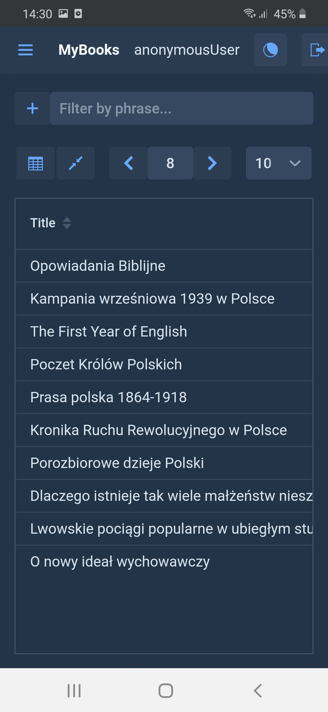
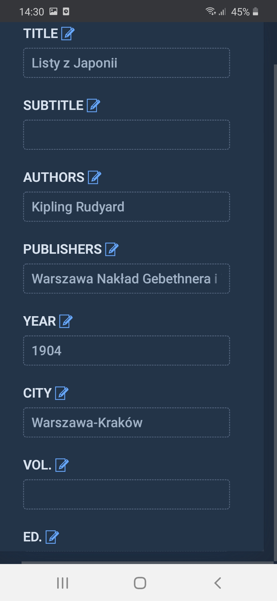
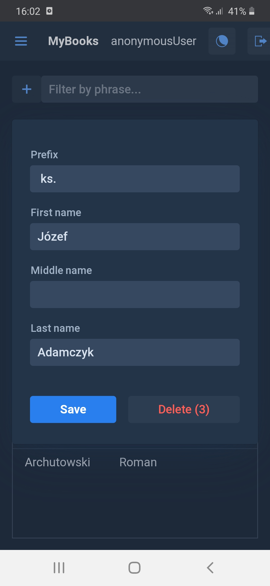

# MyBooks
A web application designed to manage private book collection.   
Check out the live demo on Heroku: https://my-books-sokolak-demo.herokuapp.com/

## Technologies & libraries
* [Java OpenJDK 14](https://openjdk.java.net/projects/jdk/14/)
* [Spring Boot 2.3.4](https://spring.io/projects/spring-boot)
	(Web, Data JPA, Security, Validation)
* [PostgreSQL 12.4](https://www.postgresql.org/)
* [H2 1.42.200](https://www.h2database.com/html/main.html)
* [Vaadin 14.3.7](https://vaadin.com/)
* [Lombok 1.18.14](https://projectlombok.org/)
* [AspectJ 1.9.6](https://www.eclipse.org/aspectj/)
* [Jaspyt 3.0.3](http://www.jasypt.org/)

## Building
To build production version, run the following Maven goal:  
`mvn clean vaadin:prepare-frontend vaadin:build-frontend package`

## Running
Proper operation of users permissions requires load-time weaving of AspectJ aspects. 
Run the app with the following VM argument:  
`-javaagent:lib/aspectjweaver-1.9.6.jar`

To take advantage of Jaspyt encryption capabilities, add the VM argument:  
`-Djasypt.encryptor.password=your_jasypt_password`

## Screenshots
 
   

## Status
Project is: _in progress_